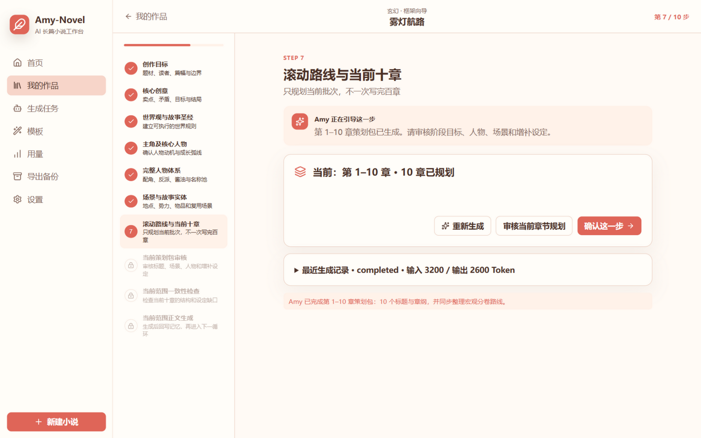
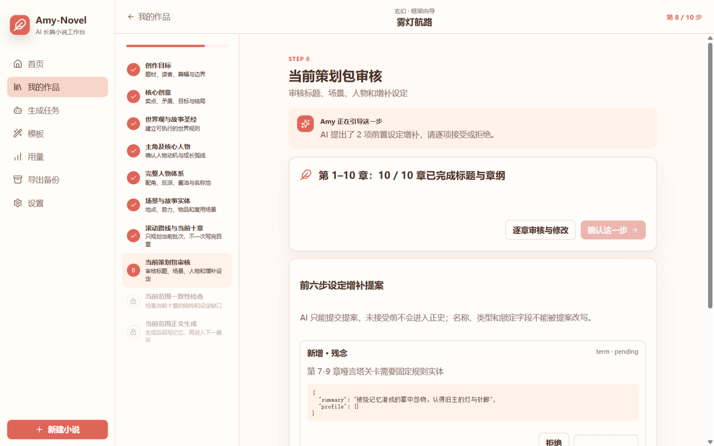
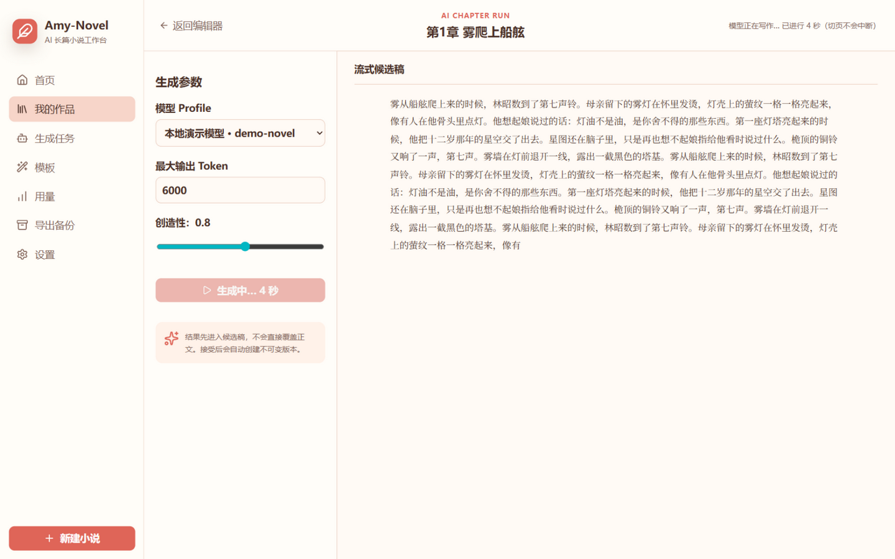
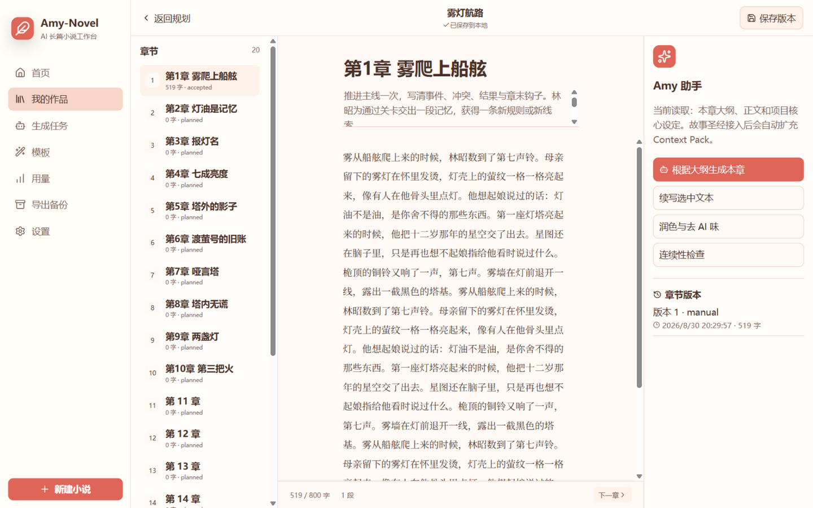
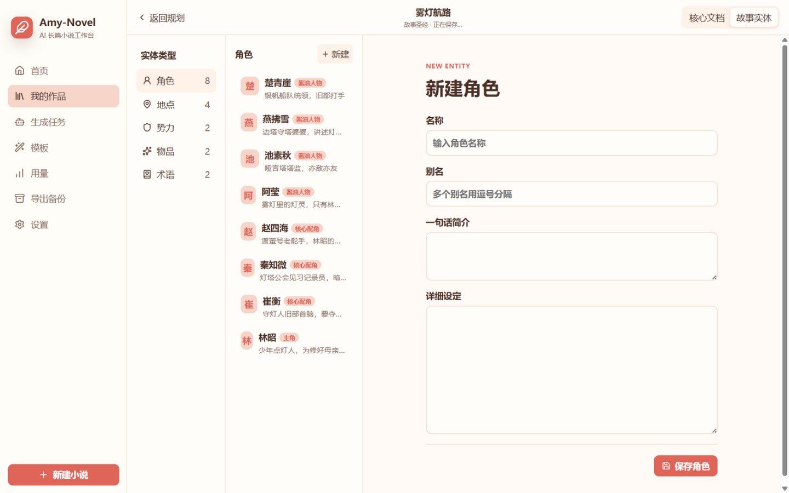
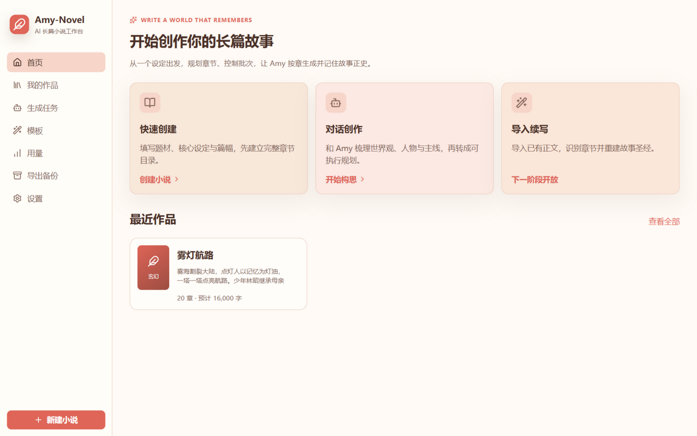

# Amy Novel

**本地优先的 AI 长篇小说创作工作台** —— 同一套 React 界面运行在 Windows Electron 与浏览器中，通过可替换的平台适配层接入本地 SQLite 与 OpenAI 兼容大模型（智谱 GLM / DeepSeek / OpenAI / Ollama 等）。你的作品、模型密钥与创作数据全部留在本机，不经过任何第三方服务器。

长篇不再"一次生成、一次失控"：Amy Novel 把创作拆成**滚动十章循环**——作品级基础一次锁定，随后每十章一个策划周期，AI 负责策划、正文与记忆提取，作者掌握每一步审核权。未接受的正文和未接受的设定提案，都不是正史。

| 十步规划向导 | 设定提案审核 |
| --- | --- |
|  |  |

| 流式正文生成 | 写作台 |
| --- | --- |
|  |  |

| 故事圣经与人物卡 | 书架首页 |
| --- | --- |
|  |  |

> 截图来自内置演示工程《雾灯航路》，可用下方"离线演示"一键复现。

## 核心特性

- **开书篇幅顾问**：不确定写多少章？Amy 按番茄平台规则（单章 2000–3000 字、黄金三章、30 章追读考核）建议总章数、单章字数、日更节奏、分卷骨架与里程碑，一键应用到创建表单。
- **滚动十章 Harness**：第 1–6 步建立可锁定的作品基础（简报、故事圣经、人物分层、场景库），第 7–10 步按当前批次循环执行——策划包 → 提案审核 → 一致性检查 → 范围内正文生成。封存周期后自动规划下一批，不会一次规划百章。每批章数可配置（5–15，默认 10），中途调整从下一批生效。
- **Autopilot 自动运行**：第 10 步选定检查点档位（关键节点暂停 / 每章暂停 / 全自动候选）后，由 Workflow Runner 自动推进规划与当前批次正文；待审提案与候选稿仍按正史门禁等待作者处理，暂停、失败与完成均可断点恢复，已通过真实模型全流程评估。
- **审核式 AI 写入**：AI 对人物、地点、势力、物品、术语的补充一律进入待审核提案，逐项接受或拒绝；实体支持整卡锁定与字段级锁定，锁定设定数据层拒绝修改。
- **正史与版本化记忆**：候选稿先落 `candidate`，作者接受后才写入章节并创建不可变版本；接受正文产生的 timeline / 角色状态（位置、身体、情绪、知识、目标、道具、技能）/ 伏笔提案，逐一接受或拒绝后才放行下一章并允许封存周期。
- **Context Pack v2**：为每一章按预算装配上下文——作者意图与禁忌、相关实体永久设定、截至上一章的最新状态、时间线与活动伏笔、近三章摘要与近两章正文。
- **文风模板库**：粘贴喜欢的样章，由 AI 分别提炼内容摘要与抽象文风指令，并保存风格名、虚构作者别名和本地原文；单章或批量生成时可选择模板，也可让模型自由发挥。生成只注入风格卡，不携带来源情节与原句。
- **生成任务队列**：批次串行执行、候选链承接（后章读前章候选）、Token 硬预算、429/5xx 退避重试、暂停恢复与集中审阅；生成状态跨页面保持，切页回来按钮仍在转。
- **规划运行日志**：每次规划调用先落库（原始响应、模型、范围、Token、错误），解析支持代码块、尾随说明与平衡 JSON 截取，失败可检视、可恢复，不覆盖已确认规划。
- **完整项目备份**：规划日志、周期、提案与人物记忆全部进入项目包，导入时自动重映射 ID。
- **双端一致**：Web 与 Electron 共用同一平台契约、提示词与解析服务；Electron 密钥走系统 safeStorage，Web 密钥只留当前会话。

## 快速开始

```bash
pnpm install
pnpm dev        # Windows Electron 模式（推荐，数据存本地 SQLite）
pnpm dev:web    # 浏览器模式（数据存浏览器本地存储）
```

1. 在「设置」中添加模型 Profile（如智谱 GLM、DeepSeek 或本地 Ollama），填入 API Key 并设为默认；
2. 「新建小说」创建作品，按十步向导推进：填写简报 → 生成故事圣经 → 人物体系 → 场景库；
3. 第 7 步生成当前十章策划包，审核设定提案并通过一致性检查；
4. 配置正文批次或单章生成，候选稿审阅后接受进入正史，系统回写记忆；
5. 全部接受后填写实际结束状态、封存周期，进入下一个十章。

其他命令：

- `pnpm typecheck`：主进程与渲染进程类型检查。
- `pnpm test`：单元测试（真实 API 端到端评估默认跳过，见下）。
- `pnpm check`：日常开发门槛，依次运行类型检查与测试。
- `pnpm verify`：完整本地门槛，额外运行 Web 与 Electron 生产构建。
- `pnpm build:web` / `pnpm build:win`：Web 产物 / Windows NSIS 安装包。
- `pnpm icons`：从品牌 PNG 生成桌面图标。

### 离线演示

不配真实模型也可以体验完整流程：

```bash
node scripts/demo-mock-model.mjs   # 启动本地 mock 模型（127.0.0.1:8787）
pnpm dev:web                       # 浏览器设置里添加 OpenAI 兼容 Profile：
                                   # Base URL http://127.0.0.1:8787/v1，密钥任意
```

mock 会为圣经、人物、场景、滚动策划和文风提炼返回合法 JSON，正文走流式输出，README 截图即由此生成。端口被占用时可用 `AMY_MOCK_PORT=8788 node scripts/demo-mock-model.mjs` 指定其他端口。

### 真实 API 端到端评估

`tests/e2e/rolling-cycle.e2e.test.ts` 提供无头驱动的完整闭环评估（1–10 章生成 → 正史确认 → 记忆回写 → 封存 → 11–20 章规划），默认跳过：

```bash
AMY_E2E_REAL=1 npx vitest run tests/e2e/rolling-cycle.e2e.test.ts
```

运行方式与密钥准备见 [真实评估报告](docs/E2E_ROLLING_CYCLE.md)。

## 文档

- [任务台账（状态唯一来源）](docs/BACKLOG.md)
- [开发与维护规范](docs/DEVELOPMENT_GUIDE.md)
- [产品规格](docs/PRODUCT_SPEC.md)
- [界面信息架构](docs/INFORMATION_ARCHITECTURE.md)
- [技术架构](docs/TECHNICAL_ARCHITECTURE.md)
- [数据库设计](docs/DATABASE_DESIGN.md)
- [阶段路线图](docs/ROADMAP.md)
- [滚动十章小说 Harness 与版本化记忆](docs/ROLLING_STORY_HARNESS.md)
- [真实 API 闭环评估报告](docs/E2E_ROLLING_CYCLE.md)
- [AI 全自动小说工作流设计](docs/AUTOPILOT_DESIGN.md)
- [AI 全自动小说工作流与验收门槛](docs/AUTOPILOT_WORKFLOW.md)
- [Windows 发布说明](docs/RELEASE.md)
- [发布验收报告](docs/ACCEPTANCE_REPORT.md)

## License

Apache-2.0
